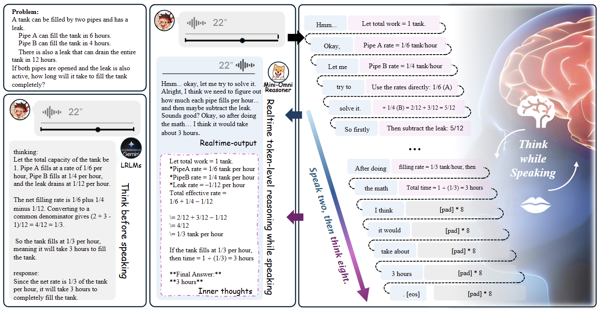
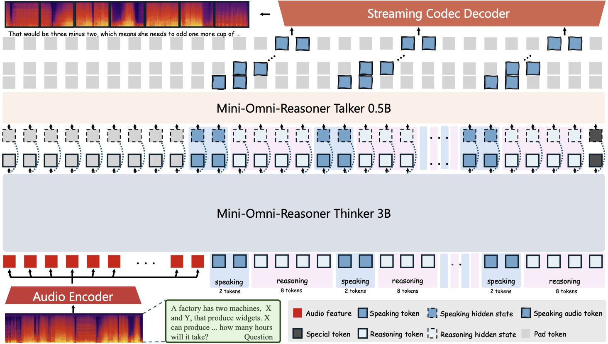
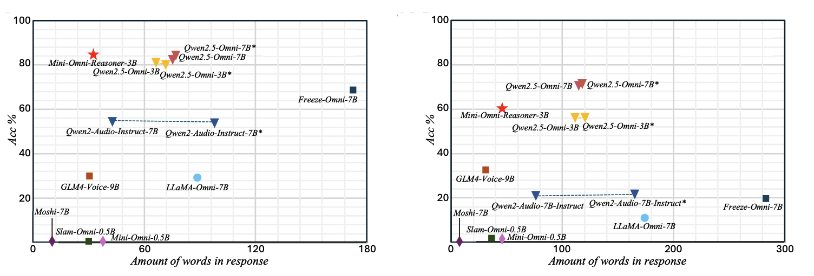

<p align="left">
English | <a href="README_CN.md">中文</a>
</p>
<br><br>

<p align="center">
    
<p>

<p align="center"> 
  🤗  Hugging Face  
| 📖  Github
| 📑  Technical report
| 🤗  Datasets
</p>


<!-- <p align="center">
🤗 <a href="https://huggingface.co/gpt-omni/mini-omni">Hugging Face</a>   | 📖 <a href="https://github.com/gpt-omni/mini-omni">Github</a> 
|     📑 <a href="https://arxiv.org/abs/2408.16725">Technical report</a> |
🤗 <a href="https://huggingface.co/datasets/gpt-omni/VoiceAssistant-400K">Datasets</a>
</p> -->

We present Mini-Omni-Reasoner, a forward-looking attempt to bring reasoning into Large Speech Models(LSMs). At this stage it only handles mathematics, but it pioneers the “thinking-in-speaking” paradigm, showing how real-time spoken interaction and inner reasoning can come together.

<p align="center">
    
<p>

## Roadmap
✅ 2025.8  - Release the technical report and GitHub repository. 

✅ 2025.8  - Release a demo video to showcase the system.

🔥 2025.9  - Release Model and inference code.

🔥 2025.10 - Opensource the Spoken-Math-Problems-3M dataset.

🔥 2025.10 - Opensource the training code.


## Demo 

TODO


## Quickstart
```
  🚀 Coming soon.  
```

## Overview

### Introduction
MINI-OMNI-REASONER is a speech reasoning model that brings real-time “thinking-in-speaking” to life. Instead of generating a full reasoning trace before speaking, it interleaves reasoning and response tokens, enabling the model to think while talking. This design reduces latency, avoids overly verbose answers, and delivers realtime, natural, and reasoning-aware spoken interaction.

<p align="center">
    
<p>


### Features
⚡️ **Thinking-in-Speaking Paradigm:** Uses an interleaved “thinking-while-speaking” strategy, where the model generates reasoning and responses in parallel. Compared to “thinking-before-speaking,” this leads to faster, shorter, and more natural spoken answers.

⚡️ **Real-Time Spoken Reasoning:**  Enables true streaming dialogue, starting to respond before reasoning is fully finished. Users experience almost no waiting, making conversations smooth and uninterrupted.

⚡️ **Balanced Reasoning and Fluency:**  Adopts a default 2:8 ratio of response to reasoning tokens, ensuring enough internal deliberation while keeping speech coherent. The ratio can be tuned to balance speed and depth depending on the scenario.

⚡️ **Stable and Controllable Generation:**  Introduces masked control tokens with padding to regulate the alternation between reasoning and responses. This prevents drift in long conversations, keeping behavior predictable and stable.

⚡️ **Shorter, but Stronger:**  Optimized for reasoning-intensive spoken scenarios. Mini-Omni-Reasoner maintains or even improves task accuracy while reducing spoken output length by nearly 50%(compared to base model Qwen2.5-omni-3B), avoiding redundant explanations. This enables the model to provide concise, precise, and interpretable answers that are both easier to follow and more efficient in real-time dialogue.

### Spoken-Math-Problems-3M Dataset


<p align="center">
    
<p>


We introduce **Spoken-Math-Problems-3M**, a large-scale dataset of **3 million math problem instances** for training reasoning-aware spoken dialogue models. The dataset is derived from high-quality text-based resources including **Orca-Math**, **MetaMath**, **GSM8K**, and **SimpleOP**, and reformulated into spoken-style queries paired with reasoning-grounded responses. We sincerely thank **Changqiao Wu** for valuable feedback on both the technical and engineering aspects of this work.  

To build this dataset, we design a **four-stage synthesis pipeline**: (1) collect diverse math problems from existing QA datasets; (2) rewrite prompts into spoken-friendly forms and decompose answers into reasoning traces plus concise responses; (3) synthesize spoken prompts via high-fidelity TTS and interleave reasoning–response tokens under a fixed 2:8 schedule; (4) apply GPT-based semantic verification to filter misaligned cases. This process ensures both **scale** and **logical alignment**, providing a solid foundation for real-time reasoning-in-speaking models.

### Training stages
<p align="center">
    
<p>


Training **Mini-Omni-Reasoner** follows a staged pipeline to transfer reasoning from text to speech with token-level interleaving:

1. **Alignment Training** 🎯 
   Initialize from Qwen2.5-Omni-3B, fine-tune audio adapter, resolve architectural differences, and align special tokens.

2. **Mixed Mathematical Pretraining** 🧮  
   Pretrain on text & speech math datasets to strengthen reasoning before interleaved generation.

3. **Textual Thinking-in-Speaking** ✍️  
   Train LLM to alternate reasoning and response tokens in text sequences.

4. **Acoustic Thinking-in-Speaking** 🔊  
   Fine-tune audio encoder for interleaved reasoning on spoken inputs.

5. **Talker Training** 🗣️  
   Train the speech synthesizer while freezing the “thinker” modules, ensuring natural, coherent spoken responses.


### Performance
<p align="center">
    
<p>

On the **Spoken-MQA** benchmark, Mini-Omni-Reasoner surpasses its base model Qwen2.5-Omni-3B, while cutting response length by more than half, and delivers reasoning ability approaching that of the much larger Qwen2.5-Omni-7B.


<p align="center">
    
<p>


## Citation
```BibTeX
@article{Mini-Omni-Reasoner,
  title={Mini-Omni-Reasoner: Token-Level Thinking-in-Speaking in Large Speech Models},
  author={Zhifei Xie, Ziyang Ma, Zihang Liu, Kaiyu Pang, Hongyu Li, Jialin Zhang, Yue Liao, Deheng Ye, Chunyan Miao, Shuicheng Yan},
  journal={arXiv preprint},
  year={2025}
}
```


