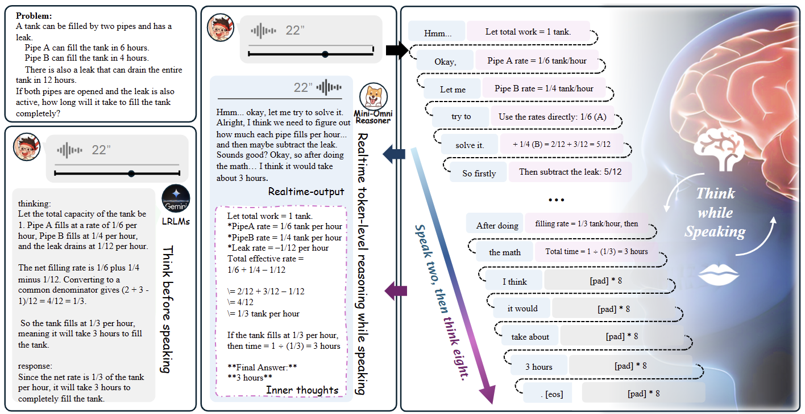
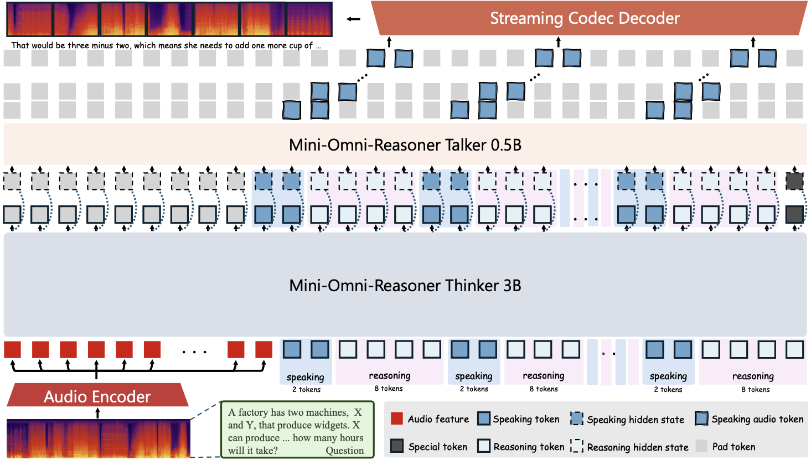
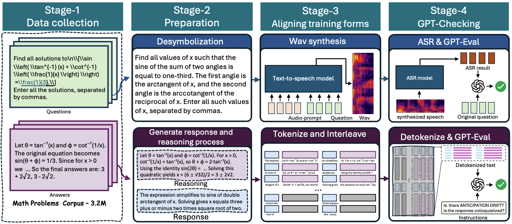
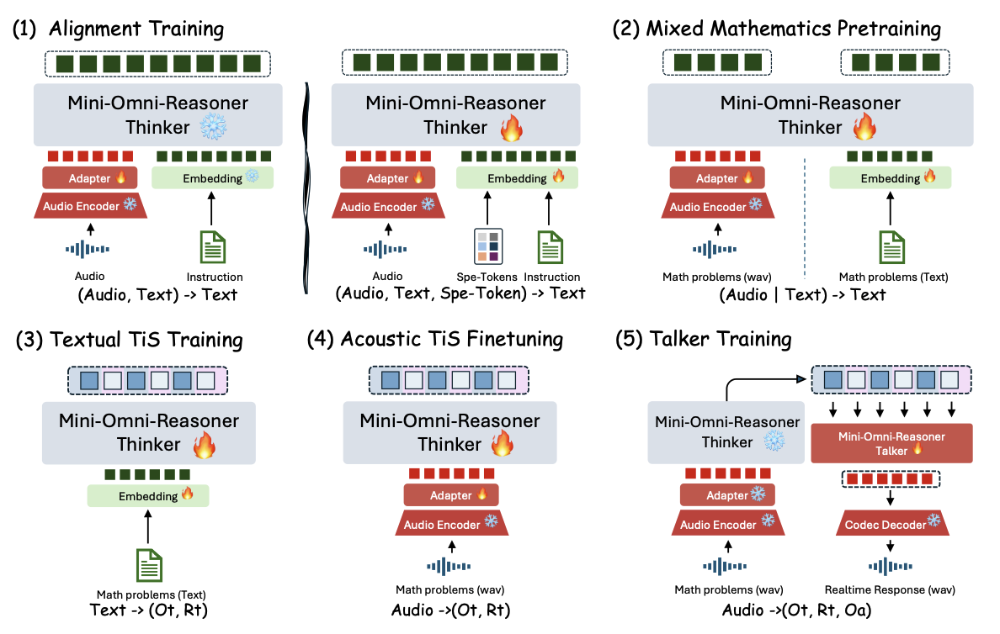
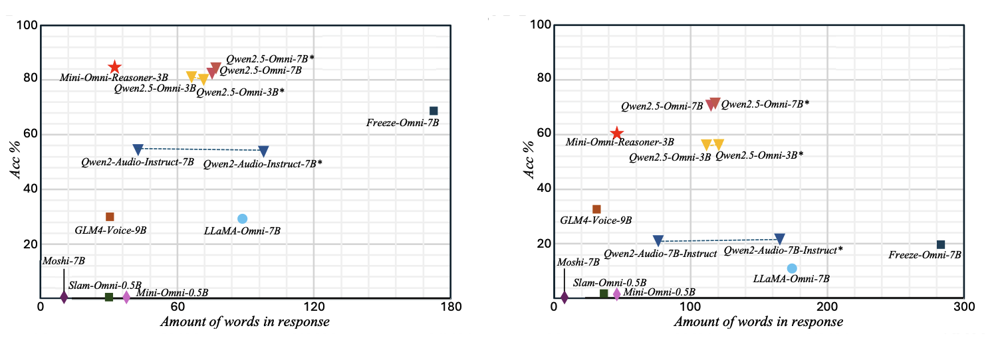
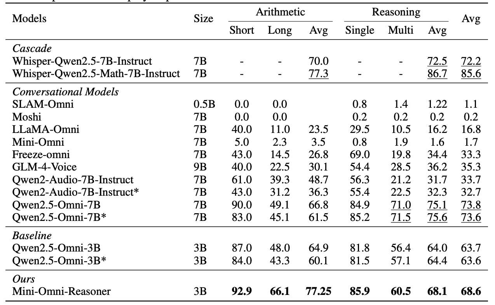

<p align="left">
<a href="README.md">English</a>  |  中文
</p>
<br><br>

<p align="center">
    
<p>

<p align="center"> 
  🤗 模型权重
| 📖 代码仓库
| 📑 技术报告
| 🤗 数据集
</p>

---

我们推出 **Mini-Omni-Reasoner**，这是一次前瞻性的尝试，旨在将推理能力引入大型语音模型（Large Speech Models，LSMs）。目前阶段它仅支持数学推理，但它开创了“**边说边思考**”（thinking-in-speaking）范式，展示了实时语音交互与内部推理如何无缝融合。  

<p align="center">
    
<p>

## 路线图
✅ 2025.8  - 发布技术报告与 GitHub 仓库  

✅ 2025.8  - 发布系统演示视频  

🔥 2025.9  - 发布模型及推理代码  

🔥 2025.10 - 开源 **Spoken-Math-Problems-3M** 数据集  

🔥 2025.10 - 开源训练代码  

## 演示
TODO

## 快速上手
```
  🚀 Coming soon.  
```

## 技术细节

### 简介
**Mini-Omni-Reasoner** 是一款语音推理模型，将实时“边说边思考”变为现实。它不需要先生成完整推理再输出，而是交错生成推理与回答 token，让模型在说话的同时思考。此设计降低了延迟，避免冗长回答，实现自然、实时、兼具推理能力的语音交互。  

<p align="center">
    
<p>

### 特性
⚡️ **边说边思考范式**：交错生成推理与回答，相比“先思考后说话”，让语音回答更快、更简短、更自然。  

⚡️ **实时语音推理**：支持流式对话，未完成推理即可开始回答，几乎无等待，确保交流顺畅。  

⚡️ **推理与流畅度平衡**：默认回答与推理 token 比例为 2:8，保证内部推理充分同时保持语音连贯，可根据场景调整。  

⚡️ **稳定可控生成**：引入带填充的控制 token，调节推理与回答交替，防止长对话漂移，行为可预测稳定。  

⚡️ **更短更强**：针对推理密集型语音场景优化。相比基础模型 Qwen2.5-Omni-3B，回答长度减少近 50%，精简且准确，避免冗余解释，让实时对话更高效易懂。  

### Spoken-Math-Problems-3M 数据集

<p align="center">
    
<p>

我们推出 **Spoken-Math-Problems-3M**，包含 **300 万条数学问题实例**，用于训练推理感知的语音对话模型。数据来源于高质量文本资源，包括 **Orca-Math**、**MetaMath**、**GSM8K** 和 **SimpleOP**，并转换为口语化问题，配有推理支撑的回答。特别感谢 **吴长桥** 对技术与工程环节的宝贵反馈。  

数据集构建采用 **四阶段生成流程**：  
1. 从现有 QA 数据集中收集多样数学问题；  
2. 将问题改写为口语化形式，并将答案拆分为推理轨迹与简明回答；  
3. 通过高保真 TTS 生成语音，并在固定 2:8 比例下交错推理–回答 token；  
4. 使用 GPT 进行语义验证，筛除不匹配样本。  

此流程确保数据 **规模大且逻辑一致**，为实时“边说边思考”模型提供坚实基础。  

### 训练阶段

<p align="center">
    
<p>

训练 **Mini-Omni-Reasoner** 采用分阶段策略，将推理能力从文本迁移到语音，并实现 token 级交错生成：  

1. **对齐训练** 🎯  
   基于 Qwen2.5-Omni-3B 初始化，微调音频适配器，解决架构差异，统一特殊 token。  

2. **数学混合预训练** 🧮  
   在文本与语音数学数据上预训练，加强推理能力，为交错生成做准备。  

3. **文本边说边思考** ✍️  
   训练 LLM 在文本序列中交替生成推理与回答 token。  

4. **语音边说边思考** 🔊  
   微调音频编码器，实现语音输入的交错推理。  

5. **语音合成训练** 🗣️  
   冻结“思考模块”，训练语音合成器，确保语音回答自然连贯。  

### 性能

<p align="center">
    
<p>

在 **Spoken-MQA** 基准测试中，Mini-Omni-Reasoner 超越基础模型 Qwen2.5-Omni-3B，同时回答长度减半，推理能力接近更大模型 Qwen2.5-Omni-7B。  

<p align="center">
    
<p>

## 引用
```BibTeX
@article{Mini-Omni-Reasoner,
  title={Mini-Omni-Reasoner: Token-Level Thinking-in-Speaking in Large Speech Models},
  author={Zhifei Xie, Ziyang Ma, Zihang Liu, Kaiyu Pang, Hongyu Li, Jialin Zhang, Yue Liao, Deheng Ye, Chunyan Miao, Shuicheng Yan},
  journal={arXiv preprint},
  year={2025}
}
```


