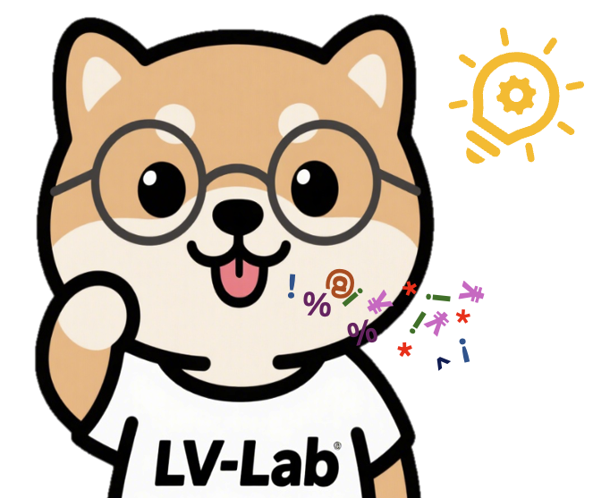
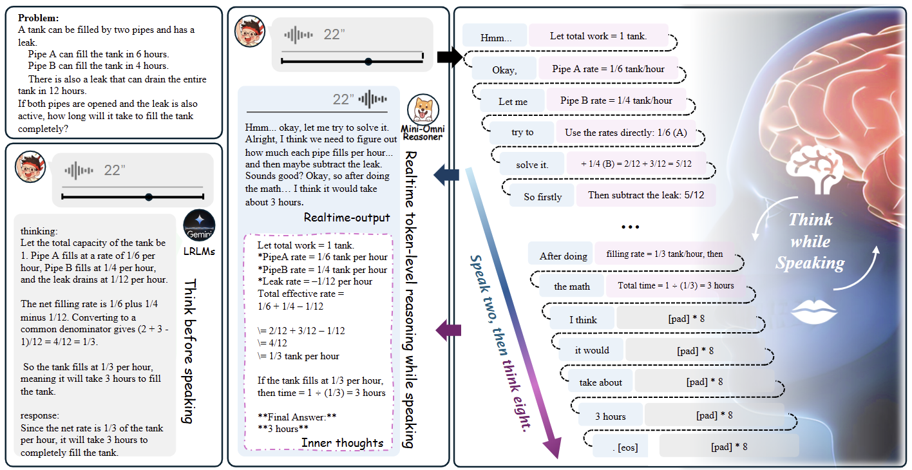

<div align="center">

  <h1 style="font-size: 3.5em; font-weight: bold; border-bottom: none;">
    Mini-Omni-Reasoner
  </h1>

  <div style="display: flex; align-items: center; justify-content: center;">
    
    <h3 style="display: inline-block; font-size: 1.2em; font-weight: normal; margin: 0; padding-left: 10px; opacity: 0; animation: fade-in 2s ease-in-out forwards;">
      A novel "thinking-in-speaking" framework for real-time speech reasoning
    </h3>
  </div>

  <style>
    @keyframes fade-in {
      from {
        opacity: 0;
        transform: translateY(10px);
      }
      to {
        opacity: 1;
        transform: translateY(0);
      }
    }
  </style>

  <p>
    <strong>Mini-Omni-Reasoner</strong> is a pioneering speech reasoning framework for real-time spoken dialogue, built on a novel <strong>"thinking-in-speaking"</strong> paradigm. It achieves state-of-the-art performance in arithmetic and contextual reasoning, and on the Spoken-MQA benchmark, it demonstrates zero decoding latency and shorter response lengths compared to baselines.
  </p>

  <p>
    <a href="[Your ArXiv Paper Link]"></a>
    <a href="[Your Project Page Link]"></a>
    <a href="[Your Hugging Face Models Link]"></a>
    <a href="[Your Online Demo Link, e.g., Hugging Face Space]"></a>
    <a href="LICENSE"></a>
  </p>

  <div style="display: flex; justify-content: center; gap: 15px; margin-top: 15px;">
    [ <a href="#-highlights">Highlights</a> ] •
    [ <a href="#-benchmarks">Benchmarks</a> ] •
    [ <a href="#-quick-start">Quick Start</a> ] •
    [ <a href="#-citation">Citation</a> ]
  </div>

</div>

---

## 📖 Overview

Mini-Omni-Reasoner is a new framework for real-time spoken dialogue reasoning, which addresses the latency issue of the conventional "thinking-before-speaking" paradigm through a novel **"thinking-in-speaking"** formulation. This framework interleaves silent reasoning tokens with spoken response tokens at the token level, allowing for fluent, zero-latency speech generation while maintaining reasoning quality.


*<p align="center">Figure 2: Overview of the Mini-Omni-Reasoner architecture, showing the interleaved generation process.</p>*

Our work aims to solve the problem of high latency and poor user experience caused by lengthy reasoning chains in existing models, such as Qwen2.5-Omni, when handling complex reasoning tasks.

## ✨ Highlights

* **🚀 Superior Performance:** Our model achieves a +19.1% improvement in arithmetic reasoning and a +6.4% improvement in contextual understanding on the Spoken-MQA benchmark.
* **💡 Architectural Innovation:** Introduces a novel **"thinking-in-speaking"** paradigm that interleaves reasoning and response at the token level, enabling zero-latency audio output.
* **⚡️ Efficient Inference:** Our model can shorten response length by more than half (42.9 vs 116.1 words), ensuring real-time interaction.
* **🌍 Open & Extensible:** Our code is fully open-sourced on [GitHub](https://github.com/xzf-thu/Mini-Omni-Reasoner) and built on the Thinker-Talker architecture, facilitating easy integration and extension.

## 🏆 Benchmarks

We conducted a rigorous evaluation of Mini-Omni-Reasoner on the Spoken-MQA benchmark.

| Model                   | Arithmetic (%)        | Reasoning (%)       | Response Length |
| ------------------------- | :---------------------: | :---------------------: | :----------------: |
| Qwen2.5-Omni (3B)           | 64.9                    | 64.0                    | 116.1 Words      |
| **MINI-OMNI-REASONER (3B)** | **77.25**                 | **68.1**                  | **42.9 Words**      |
| *Improvement vs Qwen*     | *`+12.4`*                | *`+4.1`*                  | *`-73.2 Words`*    |

*All evaluations were performed on the Spoken-MQA dataset to ensure fairness. For more detailed results, please refer to our [paper]([Your ArXiv Link]).*


## 🚀 Quick Start

### 1. Environment Setup

First, clone the repository and install the required dependencies.
```bash
git clone [https://github.com/](https://github.com/)[Your-Username]/[Your-Repo-Name].git
cd [Your-Repo-Name]
pip install -r requirements.txt
```

### 2. Inference

We provide a simple API to get you started in just a few lines of code. Make sure you are logged into the Hugging Face CLI.

```python
import torch
from transformers import AutoModelForCausalLM, AutoTokenizer

# Set device
device = "cuda" if torch.cuda.is_available() else "cpu"
model_name_or_path = "[your-model-name-on-huggingface]"

# Load model and tokenizer
tokenizer = AutoTokenizer.from_pretrained(model_name_or_path)
model = AutoModelForCausalLM.from_pretrained(model_name_or_path).to(device)

# Build the prompt
prompt = "ICLR is one of the most prestigious conferences in the field of"
inputs = tokenizer(prompt, return_tensors="pt").to(device)

# Generate text
generate_ids = model.generate(inputs.input_ids, max_length=50)
output = tokenizer.batch_decode(generate_ids, skip_special_tokens=True, clean_up_tokenization_spaces=False)[0]

print(output)
```

## 🗺️ Roadmap

### 🔹 Completed Tasks
- [x] **ICLR 2026 Paper Submission**
- [x] **Instruction-Tuned Model Release** (3B)

### 🔸 In Progress Tasks
- [ ] **Quick used demo**
- [ ] **Train code for Instruction-Tuned Model**
- [ ] **RL-based Model Release** (3B)

### 🔺 Future Milestones
- [ ] **Training Plan for Larger Scale Models** ([XXX]B)

## 🤝 Contributing

We warmly welcome contributions from the community! If you have any ideas or issues, please feel free to reach out by submitting Pull Requests or Issues.

## 📜 Citation

If you use our work in your research, please consider citing our paper:

```bibtex
@inproceedings{
  [YourLastName]2025[YourProjectName],
  title={[Your Paper Title]},
  author={[Author, A. and Author, B. and Author, C.]},
  booktitle={International Conference on Learning Representations (ICLR)},
  year={2025},
  url={[Your ArXiv Link]}
}
```

## 🙏 Acknowledgements

Our work was supported with computational resources from [Name of Cloud Provider or Supercomputing Center]. We would also like to thank [any other individuals or organizations to acknowledge].

---

<p align="center">
  Crafted with ❤️ by <strong>Lv-lab/Zhifei-Team</strong>
</p>